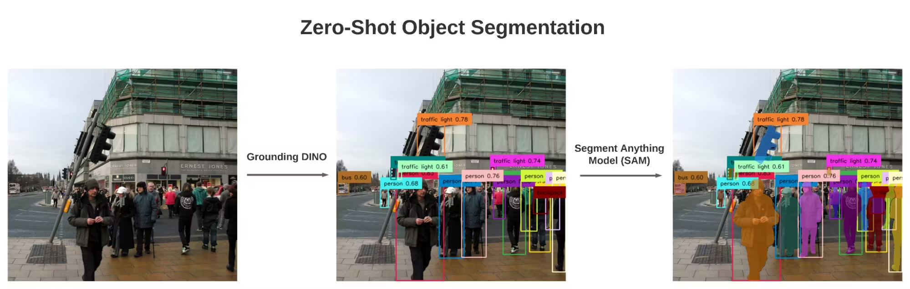
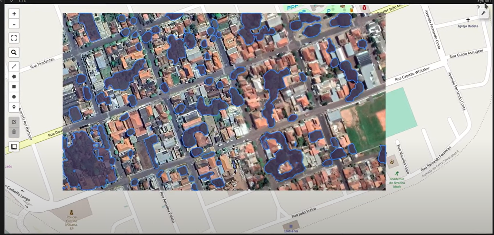
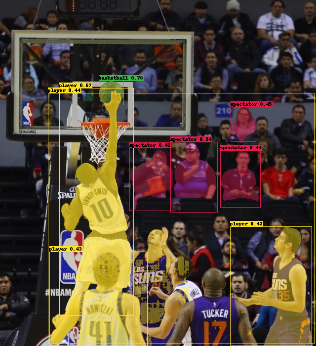
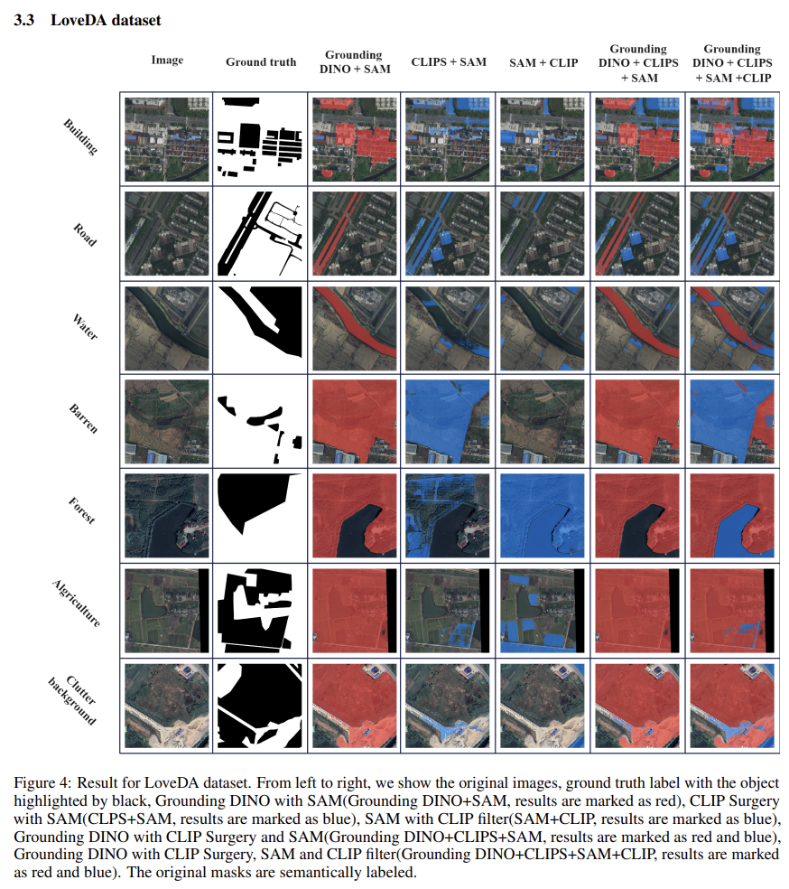

# GISTDA Internship

*Internship project from GISTDA, by Kannan Thuvakaran. Date: 04/06/2024 - Present*

## Table of Contents

- **[Project Description](#project-description)**
    - **[Original Project](#original-project)**
    - **[Proposed Project](#proposed-project)**
- **[Literature Reading](#literature-reading)**
    - **[Resources](#resources)**
    - **[Screenshots](#screenshots)**

## Project Description

### Original Project:

The original project is to create a Visual Language Model (VLM) that is able to take in a question and a satellite image an input and be able to answer the question. The endgoal would look similar to SatGPT. However, there are a few issues that makes this project impossible. 

- Good VLMs are produceds with a large dataset of image-text pairs. However in Remote Sensing, there is not enough image-text pairs to create a good dataset a good to make the VLM work for satellite images.

-  With only access to google colab free or an rtx 3060 laptop gpu,finetuning and transfer learning a good open-sourced pretrained VLM such as COGVLM requires a hardware minimum of 4 A100 or 8 RTX 3090s.

Due to these complications, I decide to propose another project that is less gpu intensive and is more realistic given the short timeframe of the internship. 

### Proposed Project:

The new project involves using Grounded Language-Image Pre-training (GLIP) or Grounding Dino as well as a dataset of many satellite imaging-related labels (forest, water, urban, village, etc) to finetune to combine with Segment Anything Model. This is known as zero-shot object segmentation.

Figure 1: Zero shot object segmentation diagram (Grounding Dino + SAM)

The endgoal will be to put in a text prompt and a satellite image input to segment it and show it in the image. For example, it highlights all the forest in image. From there we can calculate the area of the forest compared to the area in image. Another example is the number of buildings in the satellite image.

## Literature Reading

### Resources:
- Satellite Image Deep learning | [GitHub](https://github.com/satellite-image-deep-learning)
- Visual Language Models in Remote Sensing | [GitHub](https://github.com/lzw-lzw/awesome-remote-sensing-vision-language-models.git)
- SatGPT | [GitHub](https://github.com/lalligagger/satgpt.git) | [Website](https://satgpt.net/) 
- Segment Anything Model (SAM) | [GitHub](https://github.com/facebookresearch/segment-anything.git) | [Website](https://segment-anything.com/)
- Segment-geospatial using SAM | [GitHub](https://github.com/opengeos/segment-geospatial.git) | [Website](https://samgeo.gishub.org/examples/text_prompts_batch/) | [YouTube](https://www.youtube.com/watch?v=cSDvuv1zRos&ab_channel=OpenGeospatialSolutions)
- Grounding DINO | [Website](https://huggingface.co/docs/transformers/en/model_doc/grounding-dino)
- Grounded Language-Image Pre-training (GLIP) | [Github](https://github.com/microsoft/GLIP) |
- GLIP + SAM | [Code](https://colab.research.google.com/drive/1kfdizAJiD5_t-M6yFBB6t2vzGrYg8SJc#scrollTo=p2xul283jTt7)
- Remote sensing image semantic segmantation via text guided visual models | [Paper](https://arxiv.org/pdf/2304.10597)

### Screenshots:

Figure 2: Segment-geospatial using SAM. Segment of trees youtube tutorial guide from Open Geospatial Solutions. Attempt to see the accuracy when the image is on a higher altitude.

Figure 3: GLIP + SAM example code with text prompt of player, basketball and spectator. We can attempt to do this with text prompts like forest, water or villages on a satellite image.

Figure 4: Similar end-goal though we will improve using our custom dataset of different labels to further finetune the model for better accuracy for remote sensing. Also, can go further by calculating the area of the segments and the number of segments for further analysis.