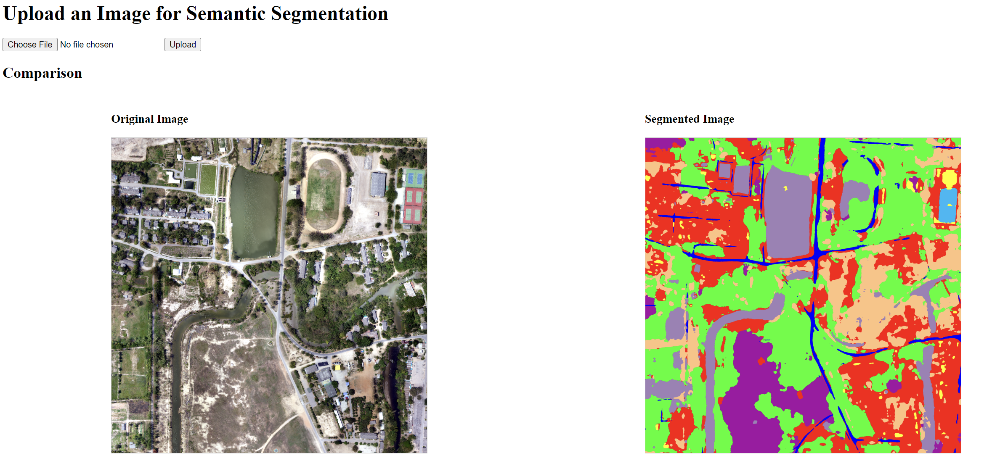

# SAT-AI: Satellite Image Analysis and Query Response Tool

### by [Kannan Thuvakaran](https://github.com/KannanThuvakaran)

## Project Overview

This project is a web application for semantic segmentation of satellite images, classifying images into the following 8 classes:

- Background
- Building
- Road
- Water
- Barren
- Forest
- Agricultural
- Playground



## Setup Instructions

1. **Conda Environment:**
   - Install the required dependencies using the `requirement.txt` file provided.

2. **Run the Application:**
   - To start the application, run the following command:
     ```bash
     python app.py
     ```

3. **Important Notes:**
   - Ensure that the directory `earthvqa_test/log/sfpnr50/my_test_features` is empty before running the application.

4. **Class-Specific Mask Conversion:**
   - If you want to train on a specific class, use the script in `earthvqa_test/multiple2singlemask` to convert images with multiple class masks into a single-class binary mask.

5. **Additional Information:**
   - For more details on testing, training, and validating the dataset, refer to the `README.md` in the `EarthVQA_test` directory.

## Resources

For relevant information on AI in satellite imagery, semantic segmentation, and visual language answering, refer to `ResearchMaterials.md`.

The `SAT-AI_Roadmap.md` file offers general direction and guidance for the project's development path.

