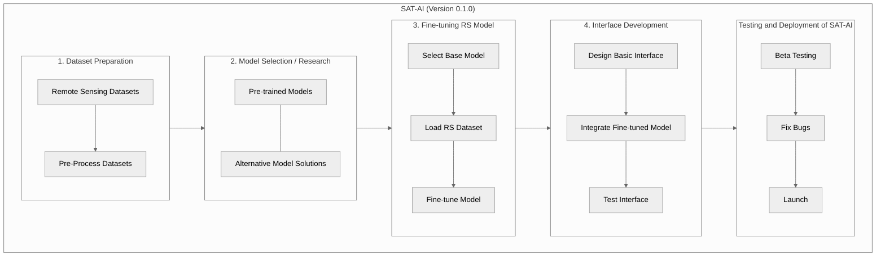

# Project Roadmap for SAT-AI Development



## Table of Contents

- [Short-Term Goals (0-12 months)](#short-term-goals-0-12-months)
  - [1. Dataset Acquisition and Preparation](#1-dataset-acquisition-and-preparation)
  - [2. Model Selection and Exploration](#2-model-selection-and-exploration)
  - [3. Model Fine-Tuning](#3-model-fine-tuning)
  - [4. Interface Development](#4-interface-development)

- [Long-Term Goals (1-3 years)](#long-term-goals-1-3-years)
  - [5. Advanced Fine-Tuning and Model Improvement](#5-advanced-fine-tuning-and-model-improvement)
  - [6. Scalability and Performance](#6-scalability-and-performance)
  - [7. Advanced Interface Features](#7-advanced-interface-features)
  - [8. Testing and Deployment](#8-testing-and-deployment)
  - [9. Continuous Improvement and Maintenance](#9-continuous-improvement-and-maintenance)

---

## Short-Term Goals (0-12 months)

### 1. Dataset Acquisition and Preparation

- **Objective**: Identify and gather datasets suitable for Remote Sensing and AI models.
  
#### Tasks:
- Acquire Remote Sensing and other relevant datasets.
- Preprocess datasets to ensure compatibility with AI models.

### 2. Model Selection and Exploration

- **Objective**: Research and evaluate Zero Shot Segmentation models and other AI architectures.
  
#### Tasks:
- Evaluate Zero Shot Segmentation models and their suitability.
- Investigate AI models like CogVLM for integration possibilities.

### 3. Model Fine-Tuning

- **Objective**: Fine-tune selected models with Remote Sensing datasets (e.g., EarthVQA, RSVQA).
  
#### Tasks:
- Fine-tune models using EarthVQA and RSVQA datasets.
- Optimize models based on performance metrics.

### 4. Interface Development

- **Objective**: Design and develop an intuitive interface for satellite imagery analysis.
  
#### Tasks:
- Design user-friendly interface for SAT-AI project.
- Implement frontend and backend components for query and analysis.
- Integrate fine-tuned models into the interface.
- Conduct extensive testing for accuracy and reliability.

---

## Long-Term Goals (1-3 years)

### 5. Advanced Fine-Tuning and Model Improvement

- **Objective**: Continuously improve models based on new data and advanced techniques.
  
#### Tasks:
- Gather additional data to enhance model performance.
- Implement advanced techniques to improve model accuracy.
- Combine multiple models for enhanced performance.
- Implement continuous training to adapt to new data trends.
- Monitor model performance over time.

### 6. Scalability and Performance

- **Objective**: Scale the model and optimize for performance.
  
#### Tasks:
- Acquire additional hardware resources (GPUs, CPUs) for faster processing.
- Optimize model architecture and algorithms for speed and efficiency.
- Implement efficient data pipelines for handling large-scale datasets.
- Test the model on larger datasets to ensure scalability.

### 7. Advanced Interface Features

- **Objective**: Enhance the user interface with advanced features and functionalities.
  
#### Tasks:
- Implement user authentication and role-based access control.
- Add analytical tools for in-depth data analysis and visualization.
- Develop a feedback system to collect user inputs and improve model capabilities.
- Enhance user experience with intuitive design and interactive features.

### 8. Testing and Deployment

- **Objective**: Prepare the model and interface for deployment in production environments.
  
#### Tasks:
- Conduct beta testing with a selected user group to gather feedback.
- Address and fix bugs identified during testing phases.
- Perform final testing to validate model performance and reliability.
- Deploy the SAT-AI model and interface on a cloud platform for global accessibility.

### 9. Continuous Improvement and Maintenance

- **Objective**: Ensure ongoing maintenance and enhancement of the deployed SAT-AI system.
  
#### Tasks:
- Monitor system performance and user feedback regularly.
- Update the model with new data and improvements as they become available.
- Provide user support and address any issues promptly.
- Incorporate user feedback into future updates and versions.
- Document updates and maintain comprehensive documentation for the SAT-AI project.

```mermaid

%%{ init : {"theme" : "neutral", "flowchart" : { "curve" : "basis" }}}%%

flowchart LR

   subgraph Long-Term Goals["Long-Term Goals (1-3 years)"]
        F[Further Fine-Tuning and Model Improvement] --> G[Scalability]
        G --> H[Perfomance]
        H --> I[Advanced Interface Features Details]
        
    end

     %% Advanced Fine-Tuning and Model Improvement Details
    subgraph F[Further Fine-Tuning and Model Improvement Details]
        direction TB
        F1[More Datasets] --> F2[Implement Advanced Techniques]
        F2 --> F3[Combine Models]
        F3 --> F4[Continuous Training]
        F4 --> F5[Monitor Model Performance]
    end

    %% Scalability Details
    subgraph G[Scalability]
        direction TB
        G1[Acquire More GPUs] --> G2[Optimize Model for Speed]
    end

    %% Performance Details
    subgraph H[Performance Details]
        direction TB
        H1[Implement Efficient Data Pipelines] --> H2[Test on Larger Datasets]
    end

    %% Advanced Interface Features Details
    subgraph I[Advanced Interface Features Details]
        direction TB
        I1[Implement User Authentication] --> I2[Add Analytical Tools]
        I2 --> I3[Develop Feedback System]
        I3 --> I4[Enhance User Experience]
    end

https://huggingface.co/spaces/Major-TOM/MajorTOM-Core-Viewer