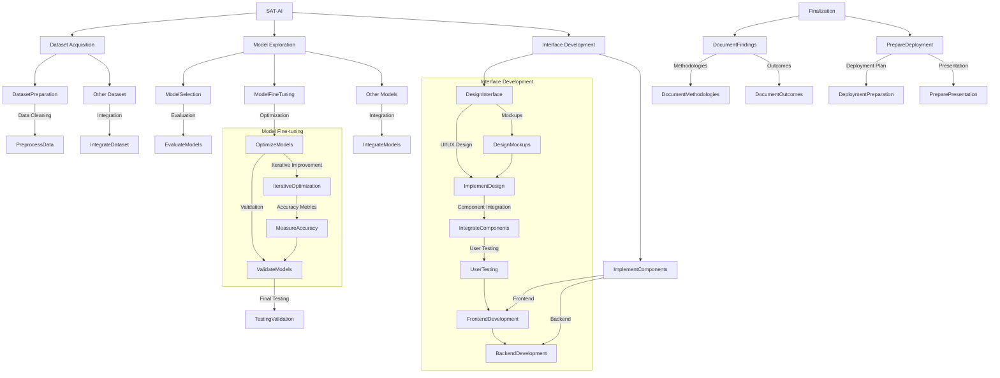

# SAT-AI: Project Roadmap

## Milestones

### 1. Dataset Acquisition and Preparation

- **Tasks:**
  - Identify and gather datasets suitable for Remote Sensing and AI models.
  - Clean and preprocess datasets for compatibility with AI models.

### 2. Model Selection and Exploration

- **Tasks:**
  - Research and evaluate Zero Shot Segmentation models (e.g., Model1).
  - Explore CogVLM and other relevant AI models for satellite image analysis.

### 3. Model Fine-tuning

- **Tasks:**
  - Fine-tune selected models with Remote Sensing datasets (e.g., EarthVQA, RSVQA).
  - Iteratively improve models based on accuracy and performance metrics.

### 4. Interface Development

- **Tasks:**
  - Design and develop an intuitive interface for querying and analyzing satellite imagery.
  - Integrate AI models to enable query answering and image segmentation functionalities.

## Detailed Tasks and Timeline

### Week 1-2: Dataset Preparation

- Identify and acquire Remote Sensing datasets:
  - Dataset for Remote Sensing
  - Other Dataset
- Clean and preprocess datasets to ensure compatibility with AI models.

### Week 3-4: Model Exploration and Selection

- Research Zero Shot Segmentation models (Model1) and evaluate their suitability.
- Investigate CogVLM and other AI models for potential integration.

### Week 5-6: Model Fine-tuning

- Fine-tune selected models using acquired datasets (EarthVQA, RSVQA).
- Optimize models based on performance feedback and validation results.

### Week 7-8: Interface Design and Development

- Design a user-friendly interface for SAT-AI project.
- Implement frontend and backend components to support query answering and image analysis.

### Week 9-10: Integration and Testing

- Integrate fine-tuned models into the interface.
- Conduct extensive testing and validation to ensure accuracy and reliability.

### Week 11-12: Documentation and Finalization

- Document project findings, methodologies, and outcomes.
- Finalize interface features and prepare for project presentation or deployment.

